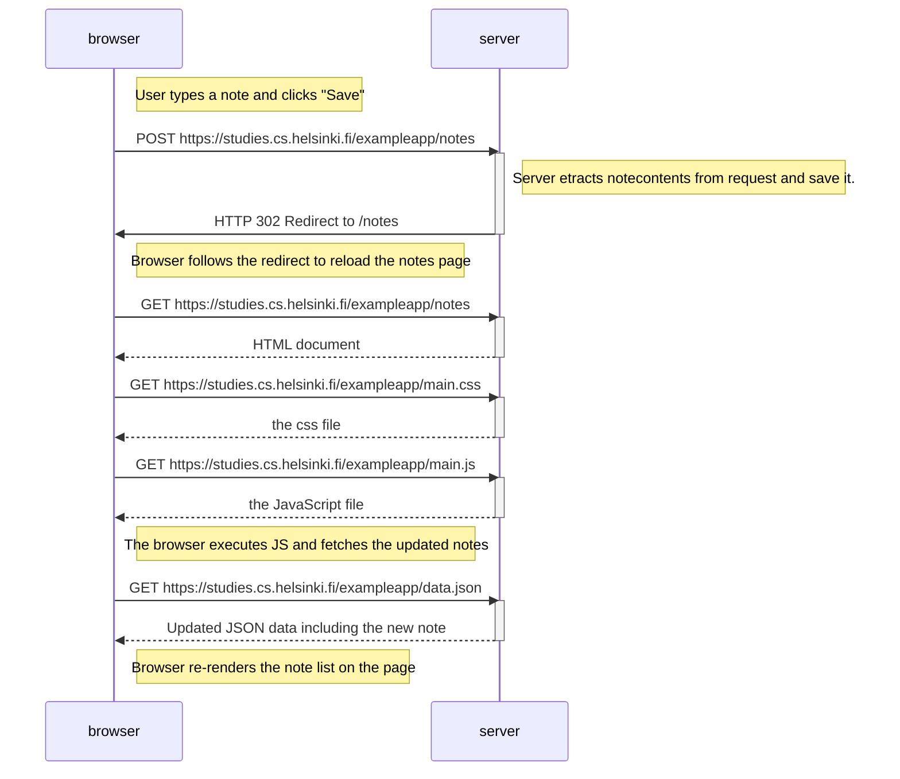

```mermaid
sequenceDiagram;

participant  browser
participant server

Note right of browser: User types a note and clicks "Save"


browser->>server : POST https://studies.cs.helsinki.fi/exampleapp/notes

activate server

Note right of server: Server etracts notecontents from request and save it.

server->>browser:HTTP 302 Redirect to /notes
    deactivate server

Note right of browser: Browser follows the redirect to reload the notes page

browser->>server: GET https://studies.cs.helsinki.fi/exampleapp/notes
    activate server

server-->>browser: HTML document
deactivate server
browser->>server: GET https://studies.cs.helsinki.fi/exampleapp/main.css
    activate server

server-->>browser: the css file
    deactivate server

browser->>server: GET https://studies.cs.helsinki.fi/exampleapp/main.js

    activate server
server-->>browser: the JavaScript file
    deactivate server
Note right of browser: The browser executes JS and fetches the updated notes

browser->>server: GET https://studies.cs.helsinki.fi/exampleapp/data.json
    activate server
server-->>browser: Updated JSON data including the new note
    deactivate server

Note right of browser: Browser re-renders the note list on the page

```

